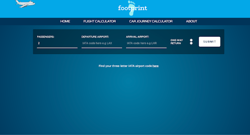
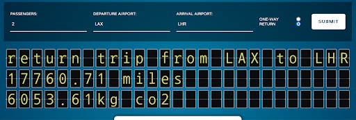

# footprint #

Paired Project  
Time Frame: 48 hours  
Visit the site: https://bit.ly/jrfootprint  

## Overview: ##

This was my second project as part of General Assembly’s Software Engineering course. In pairs, we were given 48 hours to create a front-end application that used an existing free API. My partner (the wonderful [Hannah Hill](https://github.com/hannah-hill)) and I decided to use the Carbon Interface API to create a site where users could work out their carbon footprint depending on a flight or car journey they were taking, and from that determine how many trees would need to be planted to offset that journey.




## The Brief: ##

* Use a public API - it could be anything but were reminded we were under a tight timeframe.
* The front-end must be built using React.
* The project must be deployed online by the end of the 48 hours.


## Technologies Used: ##

*  React
*  JSX
*  Axios
*  SASS
*  Yarn
*  Postman
*  Git
*  GitHub
*  Netlify (deployment)


## Day 1: ##

Due to only having 48 hours to get the project completed, my partner and I dove straight into the planning process, going through a list of API’s to determine which to use. My partner found the one we used from the Carbon Interface, and I got to work trying to make requests in Postman to ensure we could get a valid response back.


Once we were getting data back that we knew we could use, we got to work developing a wireframe for our site and started building the application. We decided to build the site only using flight data at first, and then would add in car trips later as they were slightly more complicated to work.

For this part of the project we worked together using Live Share, enabling me to remote into my partner’s VS Code so we could both work on ensuring our API call was done correctly. Once it was set up, we then created our own branches and split the workload. My partner started working on using a flight board plugin to display the results. This has been created by our tutor and he was keen to see us use it for this project. While she was working on that, I applied some basic styling to the site and got to work on sorting out the API request for the car journeys.

This was somewhat more complicated than the flight API request. For the flights we just had to establish the IATA code for each airport, whereas for the car we needed to use the id number for the type of car, as well as provide the miles for the journey. Finding the car id numbers was a long process. I first needed to make a call to find all the different brands of cars in the database, then make a call using the brand id to find the list of cars on the database for that brand, before finally finding the car id number.


Knowing this would be a time consuming process to set up for the user, especially given our limited time frame, my partner and I decided that the best course of action would be to pick five different car ‘types’ that the user can select depending which best describes their vehicle. This would mean the result wouldn’t necessarily be 100% accurate, but it should still offer a strong estimate to how much the carbon footprint of their journey would be.

To do this, we stored the id numbers for certain vehicles as variables, then assigned those values to different car types in our form using radio buttons.

```
const toyotaPriusEco2017 = 'b34f13ff-a7d8-43dc-adc9-7792163d94c7'
const audiQ7 = 'a80df211-f91e-4e0c-b56a-618eb391cb6f'
const fordFiesta = '50410886-c2d3-40a1-9c3c-be9c39dbb479'
const volvoV60 = 'fc245465-fab0-4a94-b567-5619c204a2df'
const mercedesS550 = '890ab03b-e909-45dc-8e65-9be6f0445cb6'
```

```
<div>
  <label for='small-car'>Small car </label>
  <input
    type='radio'
    id='small-car'
    name='vehicle_model_id'
    value={fordFiesta}
    onChange={handleModelSelection}
  />
</div>

```

With this system in place, we finished the first day with a simple site that could handle API requests for both car journeys and flights.

## Day 2: ##

With our MVP made on day one, we spent the second day focused on tidying everything up somewhat. My partner spent the first part of the day finalising the flight board plugin, which wasn’t originally built to work with React, and got it finished.



I got to work taking the results and working out from that how many trees would need to be planted in order to offset the journey. When the result was loaded, it would display underneath the query.


We also changed the style of our forms to the final version you see now on the site, displaying them horizontally instead of vertically, and with a dark, transparent background as opposed to a white one.

The last finishing touch I added was I created a logo to place on the header, and also added a CSS animation of a plane that travels from side to side across the page at the top.


## Wins & Blockers: ##

I think the biggest blocker for us here was time. With such a small window to work in, once we got everything running smoothly, we didn’t want to try and do something that would break everything we had before the deadline.

The other blocker was that the API we used wasn’t the easier one we came across. Several of the API’s on the free list just had one simple API call that displayed all the information that we could then filter accordingly. Our API was a tad more complex, especially when it came to finding the car models, and that took up a lot of time, which was a commodity we didn’t have a lot of.

As for wins, I really loved the styling for our site. Up until now I had always done very simple forms that read from top to bottom. My partner saw a similar form design to the one we eventually used on a different site, and we were able to recreate it successfully. I also really enjoyed getting to use SASS. I was always a fan of CSS anyway, and so the extra functionality this provided was an absolute pleasure to work with.

The other major win was that this was my first experience of coding in a team. I felt as though my partner and I worked really well throughout, communicating constantly throughout the project and working well on things together, as well as on our own.


## Bugs: ##

* The flight board plugin can be slow to respond, and sometimes will display no information and cause the information about the trees to display NaN.


## Key Learnings: ##

* Using React to build the front-end.
* Linking the front-end to an existing API.
* JSX, Insomnia, Postman, Axios.


## Future Content: ##

* Offering a better system for users to choose their car model.
* Adding in more transport methods.

